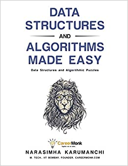
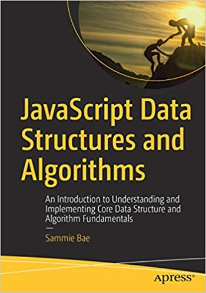

 
 # Introduction to Data Structures and Algorithms with JavaScript.

 # page content

 * [Introduction](#Introduction)
 
 * [Importance of Algorithms](#importance-of-algorithms)
 
 * [Basics of Algorithm](#basics-of-algorithm)

 * [Data Structure](#data-structure)

 * [JavaScript Data Structure and Algorithms](#javascript-data-structure-and-algorithms)

 * [Resources](#resources)


 # Introduction

 What is an Algorithm?

 An Algorithm is the step-by-step unambigous instructions to solve a given problem.
 <!--an algorithm picture should be here-->


  

 ## Importance of Algorithms


* To improve the effinciency of computer program.
* Proper utilization of resources.
* Solving real world problem.

# Basics of Algorithm
To understand basic of algorithms we are going to learn the  following:
 
 1.Analysis of Algorithms

 2.Types of analysis

 3.Asymptotic notations

 ## Analysis of Algorithms

 This is the process of finding the computational complexity of algorithms.

 Algorithm analysis help us to determine which algorithm is more efficient in terms of time and space.

 ## Type of analysis

 * Worst case - Input is the one for which the algorithm runs the slowest.

 * Best case - Input is the one for which the algorithm runs the fastest.

 * Average case - Assumes that the input is random.

 >
 lower bound <= average time <= upper bound
 >

 ## Asymptotic notations

 This are mathematical tools to represent the time complexity of algorithm for asymptotic analysis.

 The three asymptotic notations:

 1. Θ Notation

 Theta notation bounds a function from above and below.

 <!--a pic of theta-->
 

 2. Big O Notation
 
 It defines the upper bound of an algorithm.

 <!--a pic of big o -->
 

 3. Ω Notation

 Provide asymptotic lower bound.

 <!--a pic of omega-->
 


 # Data Structure

 It's an orderly arrangement of data in computer to use it more efficient.

 Data structure are classified into two types:

 1. Linear data structures - Elements are accessed in a sequantial order but it is not compulsory to store all elements sequentally.

 Examples:
  
   * Linked list
   * Stacks
   * Queue

   2. Non-linear data structure - Elements of this data structure are stored or accessed in non-linear order.

   Examples:

   * Trees
   * Graphs

 ## Relationship between Algorithm and Data Structure.

 The following are the main categories of Algorithm in relation to data structure.

 * Search
 * Insert
 * Sort
 * Update
 * Delete

 # JavaScript Data Structure and Algorithms

 Below we are going to discuss about JavaScript Data Structure and Algorithm.

 We are going to cover the following areas:

 1. Linked list
 2. Stacks
 3. Queues
 4. Arrays

 ## Linked List

 Linked list is a data structure which each node points to another node.

 Two type of linked list we will discuss are:

  1. Singly
  2. Doubly

  ## Singly linked lists

  Singly linked list are the one with data and next data is the value for the linked list node and the text is a pointer of another.

  ```js

  function SinglyLinkedListNode (data){
      this.data = data;
      this.next = null;
  }
  ```

  ## Doubly linked lists

  Contains an extra pointer,typically called previous pointer together with next pointer and data which are there in singly linked list.

  ```js

  var head;
  class Node {
      constructor (val){
          this.data = val;
          this.prev = null;
          this.next = null;
      }
  }
```

## Stacks

Stacks is the data  structure in which only the last inserted element can be removed and accessed.

For example lets think of  stacking plates on the tables,to get to the bottom plate you have to remove the other plates.

This principal  is called *last in first out*.

```js
function Stack(array){
    this.array = [];
    if (array)this.array = array;
}
stack.prototype.getBuffer = function (){
    return this.array.slice();
}

stack.prototype.isEmpty = function (){
    return this.array.length = 0;
}

var stack1 = new stack();
console.log(stack1);
```

Fundamental to look at concerning stack are:
 
 * peek
 * insertion
 * deletion
 * access
 * search 

 ## Queues

 A queue is also a data structure but you can remove only the first added element.

 This principal is called *first in first out*.

 ```js

 function queue (array){
     this.array =[];
     if (array) this.array = array;

 }

queue.prototype.getBuffer = function (){
    return this.array.slice ();
}

queue.prototype.isEmpty = function (){
    return this.array.length === 0;
}

var queue1 = new queue ();
console.log(queue1);

```

Fundamentals to look at in queues are:

  * peek
  * insertion
  * deletion
  * access
  * search

  ## Arrays

  Arrays are one of the most fundamental of data structure.

  ` var array1= [1,2,3,4,5];`


Some of the fundamentals operation associated with array are:

* insertion 
* deletion
* access
* iteration

# Resources

Some of the resources you can use to study Data Structure and Algorithms are listed below.

 1. Data Structure and Algorithms Made Easy *by Narasimha karumanchi*
 <!--a pic-->

 

 2. JavaScript Data Structure and Algorithms *by Sammie Bie*

 <!--a pic-->
 
